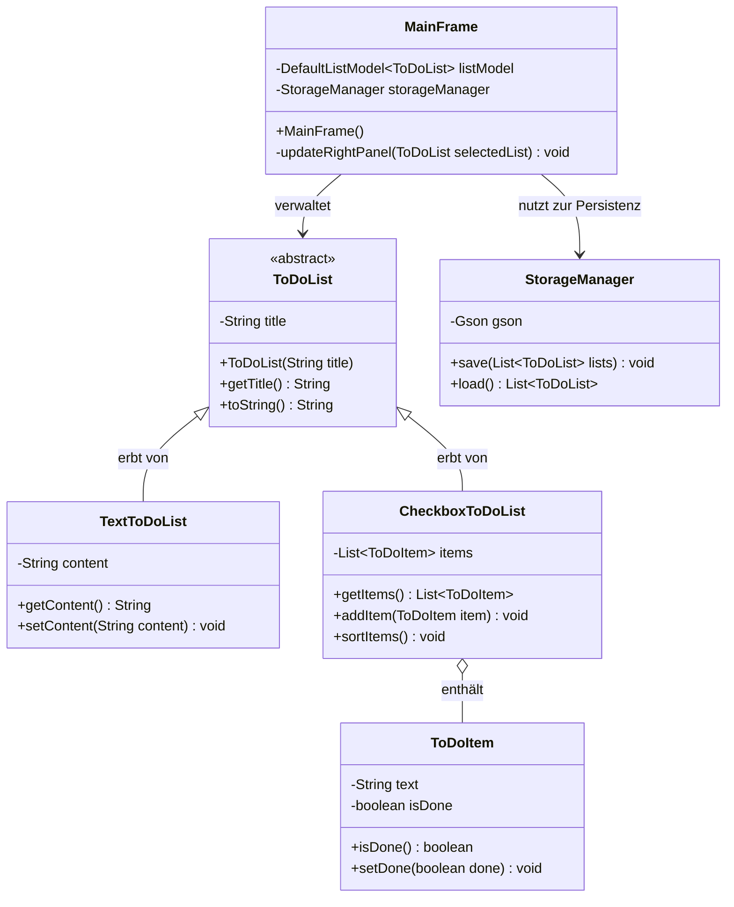

# 📝 Meine ToDo App (Java Swing)

Eine moderne, persistente ToDo-Listen-Anwendung, entwickelt in Java. Dieses Projekt demonstriert den sicheren Umgang mit objektorientierter Programmierung (OOP), Benutzeroberflächen mit Java Swing und Datenspeicherung via JSON.

## ✨ Features

* 🌗 **Modernes Design:** Vollständiger, augenschonender Dark Mode mit angepassten UI-Komponenten (ohne Standard-Windows-Grau).
* 📋 **Zwei Listen-Typen:** Unterstützung für einfache Fließtext-Notizen (`TextToDoList`) und interaktive Aufgabenlisten (`CheckboxToDoList`).
* 🧠 **Smarte Checkboxen:** Abgehakte Einträge werden automatisch durchgestrichen, ausgegraut und ans Ende der Liste sortiert.
* 💾 **Daten-Persistenz:** Automatisches Speichern und Laden aller Listen im `.json`-Format über die Bibliothek *Google Gson*. Nichts geht beim Schließen verloren!
* 🗑️ **Sicheres Löschen:** Ganze Listen können (mit vorheriger Sicherheitsabfrage) gelöscht werden. Einzelne Checkbox-Einträge lassen sich über einen Button entfernen.

## 🛠️ Verwendete Technologien

* **Sprache:** Java (JDK 11 oder neuer)
* **GUI-Framework:** Java Swing & AWT
* **Daten-Serialisierung:** Google Gson (JSON)
* **Build-Management:** Maven

## 🚀 Installation & Start

1. **Repository klonen:**
   ```bash
   git clone <https://github.com/FranzEP/ToDoApp>

2. **Projekt in der IDE öffnen:**
   Öffne den Ordner in IntelliJ IDEA oder Eclipse. Das Projekt wird dank der `pom.xml` automatisch als Maven-Projekt erkannt.
3. **Abhängigkeiten laden:**
   Maven lädt die Gson-Bibliothek automatisch herunter.
4. **App starten:**
   Führe die Datei `src/main/java/app/Main.java` aus.

## 🏗️ Software-Architektur (UML)

Das Projekt nutzt Vererbung, um verschiedene Listenarten effizient zu verwalten, und trennt die Datenlogik sauber von der Benutzeroberfläche.




## 👨‍💻 Entwickelt von

* **[Franz Pfund / FranzEP]**
* Im Rahmen eines Hochschul-Projekts.